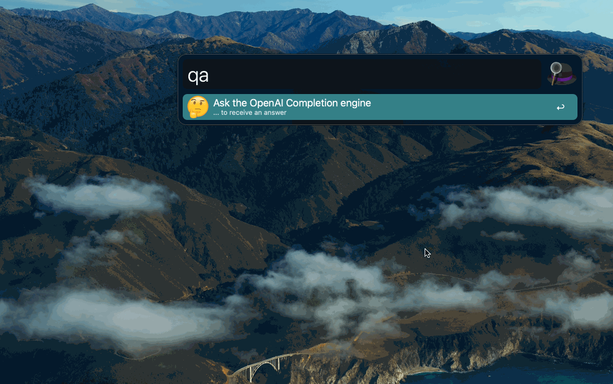

# OpenAI Model Communication

This project provides a convenient way to communicate with OpenAI models through various interfaces. The following methods are currently supported:

## Golang executable

Run the cli tool and enter your queries directly in the terminal.

```bash
./ask-gpt "Why trees have so many branches?"
```

## Alfred workflow

Use the provided Alfred workflow to quickly access the model and input your queries without leaving your current application.

Fast answer:

```
qa Why trees have so many branches?
```

More expensive and larger answer:

```
qal Why trees have so many branches?
```

### Fast backend

<p align="center">
  
</p>

### More expensive and capable backends

<p align="center">
  
</p>

## Raycast script

Activate Raycast, type `ask` and `<tab>` to start filling the prompt argument. 

```
ask Why trees have so many branches?
```

Find out more in the Readme file located in the `raycast` directory.

<p align="center">
  
</p>

## Other tools?

As you can see MacOS is doubly covered, but what about Windows and Linux? I'll be writing other integrations too, but you're more than welcome to submit PRs with your implementation for tools like Wox or Cerebro!

# Installation

- Clone the repository to your local machine.

## Alfred workflow:

- Install `requests` using `python3 -m pip install requests`
- `Cmd+click` the `.alfredworkflow` file and follow the instructions in the config step. You'll have to supply your OpenAI API key.

<p align="center">
  
</p>

## Golang executable

Build it yourself with the [Golang build](https://go.dev/doc/install) tool:

```
cd cli
go build
```

## Raycast script

1. Add the `ask-gpt.py` script to a directory of your choice, be it an already existing scripts directory or a new one like this `raycast` directory. 
  > If it's a new directory, you'll have to tell Raycast about it 
  - In Raycast, go to `Extensions`, then `scripts`, click the `Add` icon, `pick script directory` and point it to the directory you chose.
2. Create a new file in the same scripting directory and name it `openai.toml`. Put your API key in it like `apikey = "sk-abcde"`
3. This script references `#!/usr/bin/env python3` for Python, but you might want to repoint it at an installation that works for you. The script needs `requests` and `toml` - though feel free to modify.

You should be good to go. Fire up Raycast, type `ask` and `<tab>` to start filling the prompt argument.

<p align="center">
  
</p>
