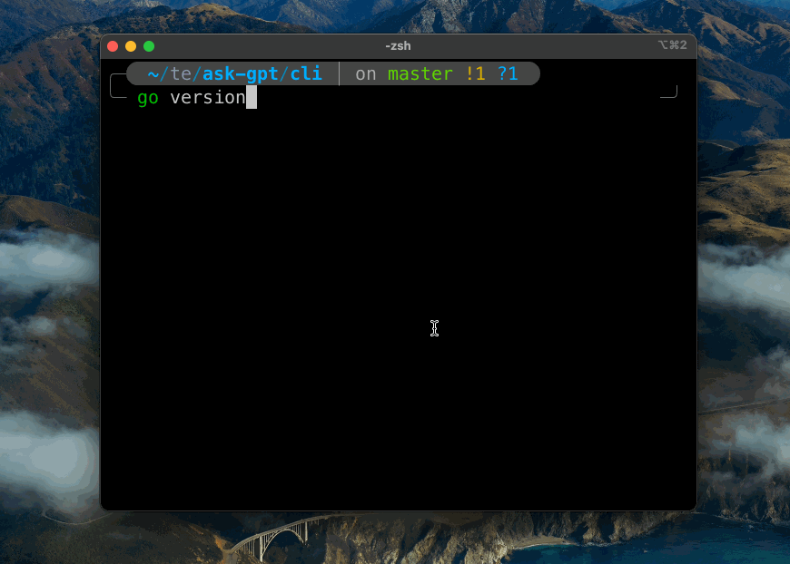

## Installation

Building from source:

- [Install Go](https://go.dev/doc/install)
- Navigate to the `cli` directory 
- run `go build`

```
cd cli
go build
```

## Use

```bash
./ask-gpt "Why do trees grow branches?"
```

<p align="center">
  
</p>


## Config

Required 

- OPENAI_API_KEY

Optional

- OPENAI_MAX_TOKENS
    - Can vary from `1` to `2048` (newer models allow `4000` for large answers)
- OPENAI_TEMPERATURE
    - `0.0` meaning the safest answer, `1.0` most 'diverse', here the default is `0.7`
- OPENAI_MODEL
    - [Reference](https://beta.openai.com/docs/models/gpt-3) 
    - `text-davinci-003`
    - `text-curie-001`
    - `text-babbage-001`
    - `text-ada-001`

Example of a `.env` file:

```
OPENAI_API_KEY=sk-abcdefg
OPENAI_MODEL=text-davinci-003
OPENAI_TEMPERATURE=0.7
OPENAI_MAX_TOKENS=30
```
